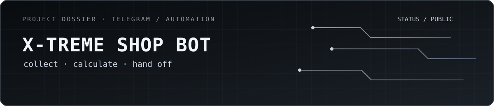
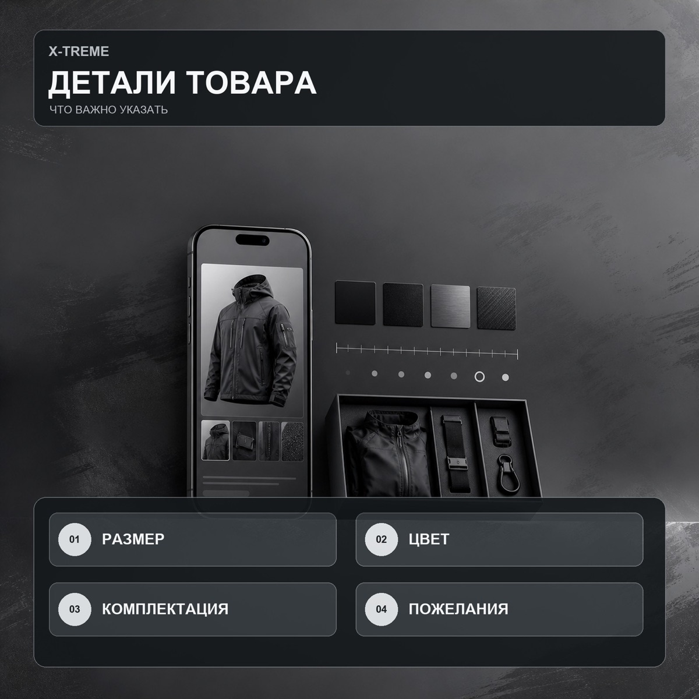
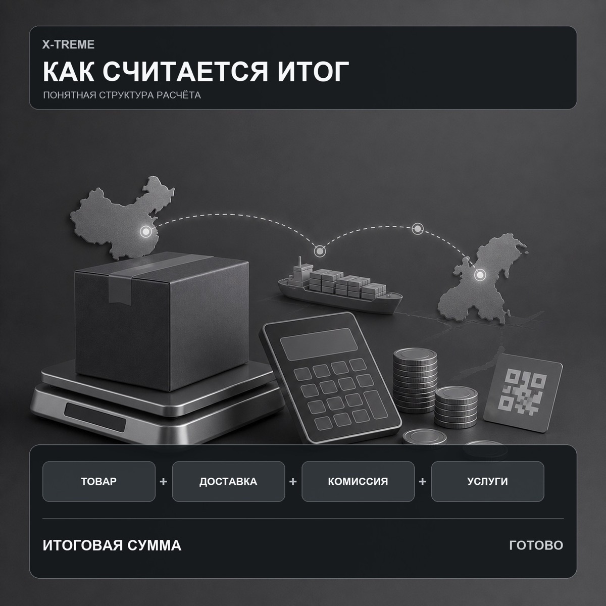

  

  <a href="./README.md">Русский</a> · <strong>English</strong> · <a href="https://github.com/mrjakeball/portfolio">All projects</a> · <a href="https://t.me/XtremeShopBot">Open the bot ↗</a>

# X‑TREME Shop Bot

A Telegram bot for estimating and submitting orders from Poizon and Taobao, from item details through to a structured support hand-off.

> An independent project that is not affiliated with Poizon or Taobao and is not an official service of either company.

| Fact | Details |
|---|---|
| Format | Telegram bot |
| Status | Available through a public link · [@XtremeShopBot](https://t.me/XtremeShopBot) |
| Stack | `Python 3.11` `aiogram 3` `SQLite` `Pillow` `QR / HMAC` |
| Source | Private; this repository contains only the showcase |

  
  

> The gallery contains promotional and instructional materials used by the bot. These are not screenshots of private conversations or customer orders.

## Order journey

Guide a user through item details, delivery and fee calculations, then give the operator a structured request without manually copying every field.

## What the bot handles

- step-by-step FSM flows and a multi-item cart;
- collection of links, item parameters and supporting images;
- item, delivery and fee calculations;
- a temporary PNG summary and request hand-off to support.

## Flow reliability

Consistent state across long conversations, SQLite persistence and HMAC signatures for QR-link integrity. No user data is included in the public showcase.

  <a href="https://github.com/mrjakeball/portfolio">← Back to all projects</a>

